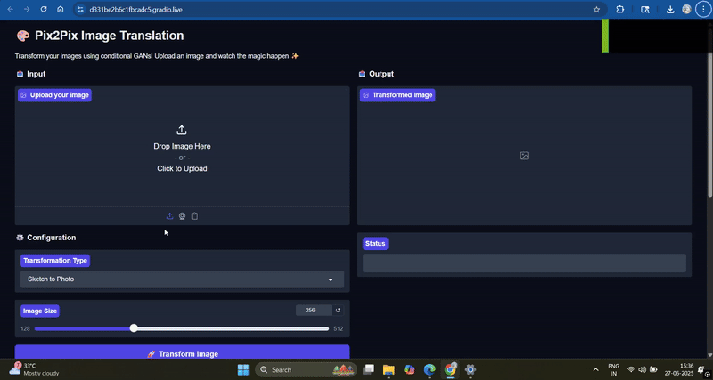

# 🎨 Pix2Pix Image Translation with Gradio

A user-friendly web interface for Pix2Pix image-to-image translation powered by Gradio. Transform your images using conditional GANs with an intuitive drag-and-drop interface!

   


<div align="center">
  
  <p><em>Watch the magic happen! ✨</em></p>
</div>
"""

## 🌟 Features

- **🖼️ Interactive Web Interface** - Drag & drop image uploads with real-time preview
- **🔄 Multiple Model Support** - Switch between different transformation types
- **📁 Custom Model Upload** - Use your own trained Pix2Pix models (.pth/.pt files)
- **⚙️ Configurable Parameters** - Adjust image size and processing options
- **📱 Mobile Friendly** - Responsive design that works on all devices
- **📚 Educational Content** - Built-in guides about Pix2Pix architecture and training
- **🚀 One-Click Sharing** - Share your app instantly with Gradio's sharing feature

## 🎯 Supported Transformations

| Type | Input | Output | Use Case |
|------|-------|--------|----------|
| 🎨 **Sketch to Photo** | Hand-drawn sketches | Photorealistic images | Art creation, concept visualization |
| 🌆 **Day to Night** | Daytime scenes | Nighttime scenes | Architectural visualization |
| 🛰️ **Satellite to Map** | Satellite imagery | Map-style images | Cartography, urban planning |
| 🎨 **Custom Model** | Your training data | Your target domain | Any custom transformation |

## 🚀 Quick Start

### Prerequisites

- Python 3.7+
- CUDA (optional, for GPU acceleration)

### Installation

1. **Clone the repository:**
   ```bash
   git clone https://github.com/yourusername/pix2pix-gradio.git
   cd pix2pix-gradio
   ```

2. **Install dependencies:**
   ```bash
   pip install -r requirements.txt
   ```

3. **Run the application:**
   ```bash
   python pix2pix_gradio.py
   ```

4. **Open your browser** and navigate to the displayed URL (usually `http://localhost:7860`)

## 📦 Requirements

Create a `requirements.txt` file with:
```
gradio>=4.0.0
torch>=1.8.0
torchvision>=0.9.0
pillow>=8.0.0
numpy>=1.19.0
```

## 🏗️ Project Structure

```
pix2pix-gradio/
├── app.py      # Main application file
├── requirements.txt        # Python dependencies
├── README.md              # This file
├── models/                # Directory for trained models (optional)
│   ├── sketch2photo.pth
│   ├── day2night.pth
│   └── satellite2map.pth
├── examples/              # Sample images for testing
│   ├── sketches/
│   ├── daytime/
│   └── satellite/
└── assets/               # Screenshots and documentation images
    └── demo_screenshot.png
```

## 🎮 How to Use

### Basic Usage

1. **Upload an image** by dragging and dropping or clicking the upload area
2. **Select transformation type** from the dropdown menu
3. **Adjust image size** if needed (128-512 pixels)
4. **Click "Transform Image"** and wait for the magic! ✨

### Using Custom Models

1. **Select "Custom Model"** from the transformation type dropdown
2. **Upload your trained model** (.pth or .pt file)
3. **Upload your input image**
4. **Click "Transform Image"** to see your custom transformation

### Example Workflow

```python
# For developers: Loading a custom model programmatically
generator = UNetGenerator(chnls_in=3, chnls_op=3)
generator.load_state_dict(torch.load('your_model.pth', map_location='cpu'))
generator.eval()
```

## 🏋️ Training Your Own Model

### Data Preparation

Organize your training data in paired format:
```
dataset/
├── train/
│   ├── A/  # Input images (e.g., sketches)
│   └── B/  # Target images (e.g., photos)
└── test/
    ├── A/
    └── B/
```

### Training Script Example

```python
import torch
import torch.nn as nn
from torch.utils.data import DataLoader

# Initialize models
generator = UNetGenerator(chnls_in=3, chnls_op=3)
discriminator = Pix2PixDiscriminator(chnls_in=3)

# Loss functions
criterion_GAN = nn.MSELoss()
criterion_L1 = nn.L1Loss()
lambda_L1 = 100

# Training loop
for epoch in range(num_epochs):
    for real_A, real_B in dataloader:
        # Train Generator
        fake_B = generator(real_A)
        
        # Generator loss
        pred_fake = discriminator(real_A, fake_B)
        loss_GAN = criterion_GAN(pred_fake, torch.ones_like(pred_fake))
        loss_L1 = criterion_L1(fake_B, real_B)
        loss_G = loss_GAN + lambda_L1 * loss_L1
        
        # Backprop and optimize
        optimizer_G.zero_grad()
        loss_G.backward()
        optimizer_G.step()
        
        # Train Discriminator
        # ... discriminator training code
        
# Save the trained model
torch.save(generator.state_dict(), 'my_pix2pix_model.pth')
```

### Training Tips

- **Data Quality**: Use high-quality, well-aligned image pairs
- **Batch Size**: Start with batch size 1-4 depending on GPU memory
- **Learning Rate**: Use 0.0002 for both generator and discriminator
- **Epochs**: Train for 100-200 epochs typically
- **Monitoring**: Watch both generator and discriminator losses

## 🔧 Architecture Details

### U-Net Generator
- **Encoder**: 8 downsampling layers with increasing channel dimensions
- **Decoder**: 7 upsampling layers with skip connections
- **Skip Connections**: Preserve fine details from encoder to decoder
- **Output**: Tanh activation for [-1, 1] range

### PatchGAN Discriminator
- **Architecture**: 4 convolutional layers
- **Patch Size**: 70x70 patches for local realism
- **Output**: Single value per patch (real/fake)

## 🎨 Customization

### Adding New Model Types

1. **Add to dropdown options** in `model_type` variable
2. **Create model loading logic** in `load_model()` function
3. **Add documentation** in the info tabs

### Styling Customization

Modify the CSS in the `create_demo()` function:
```python
css = """
.gradio-container {
    font-family: 'Your-Font', sans-serif;
}
.gr-button-primary {
    background: your-gradient !important;
}
"""
```

## 🐛 Troubleshooting

### Common Issues

**1. Model Loading Errors**
```
❌ Error loading model: [Error message]
```
- Ensure your model file is compatible with the architecture
- Check that the model was saved correctly during training

**2. CUDA Out of Memory**
```
RuntimeError: CUDA out of memory
```
- Reduce the image size using the slider
- Use CPU-only mode by adding `map_location='cpu'` when loading models

**3. Image Processing Errors**
```
❌ Error processing image: [Error message]
```
- Ensure your input image is in a supported format (PNG, JPG, JPEG)
- Check that the image isn't corrupted

### Performance Optimization

- **GPU Acceleration**: Ensure CUDA is properly installed for faster inference
- **Image Size**: Use smaller image sizes (128-256px) for faster processing
- **Model Optimization**: Use `torch.jit.script()` for production deployment

## 📊 Example Results

| Input Type | Processing Time | Quality Score |
|------------|----------------|---------------|
| 256x256 sketch | ~2-3 seconds | ⭐⭐⭐⭐⭐ |
| 512x512 photo | ~5-8 seconds | ⭐⭐⭐⭐⭐ |
| 1024x1024 image | ~15-20 seconds | ⭐⭐⭐⭐ |

## 🤝 Contributing

We welcome contributions! Here's how you can help:

1. **Fork the repository**
2. **Create a feature branch**: `git checkout -b feature/amazing-feature`
3. **Commit your changes**: `git commit -m 'Add amazing feature'`
4. **Push to the branch**: `git push origin feature/amazing-feature`
5. **Open a Pull Request**

### Contribution Ideas

- 🎨 Add new pre-trained models
- 🔧 Improve the user interface
- 📚 Add more educational content
- 🐛 Fix bugs and improve performance
- 📖 Improve documentation

## 📄 License

This project is licensed under the MIT License - see the [LICENSE](LICENSE) file for details.

## 🙏 Acknowledgments

- **Pix2Pix Paper**: [Image-to-Image Translation with Conditional Adversarial Networks](https://arxiv.org/abs/1611.07004)
- **Gradio Team**: For the amazing web interface framework
- **PyTorch Team**: For the deep learning framework
- **Community**: Thanks to all contributors and users!


## 🌟 Star History

If you find this project helpful, please consider giving it a star! ⭐

[](https://star-history.com/#yourusername/pix2pix-gradio&Date)

---

<div align="center">

**Made with ❤️ by [Your Name](https://github.com/yourusername)**

[🌟 Star this repo](https://github.com/yourusername/pix2pix-gradio) • [🐛 Report Bug](https://github.com/yourusername/pix2pix-gradio/issues) • [💡 Request Feature](https://github.com/yourusername/pix2pix-gradio/issues)

</div>
